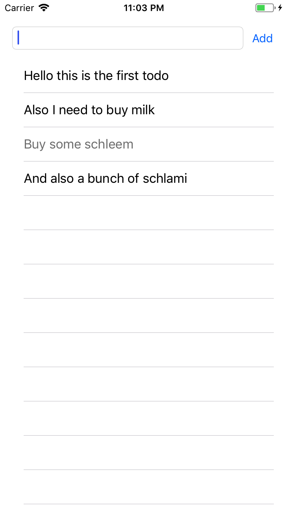
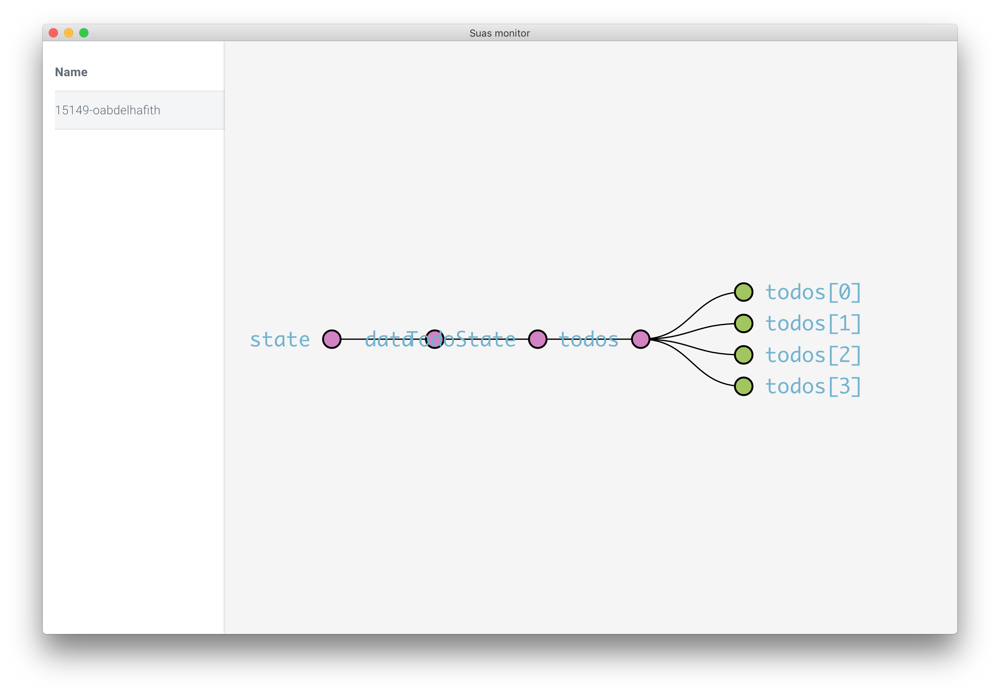

# Suas Todo App Sample



Todo sample app built using [Suas-iOS](https://github.com/zendesk/Suas-iOS). It also uses the [Monitor middleware](https://github.com/zendesk/Suas-Monitor-Middleware) to send the state to [Suas Monitor](https://travis-ci.com/zendesk/Suas-Monitor).

Requirements:
- Xcode 8+
- Swift 3+

Install:

```
pod install
```

Open the sample app and run it.

## Using Suas monitor


- Download Suas monitor and open it
- Run the app and select the device from the list of devices

## Examples In This Repo

This repo contains an Xcode project with four different examples:

### Counter Example
Simplest application possible. The app consists of a counter that can be incremented and decremented by tappoing on UI buttons.

### TodoAppExample
